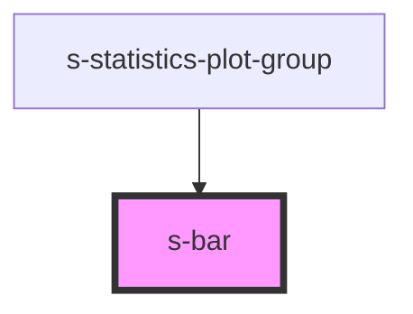

# s-bar

<!-- Auto Generated Below -->

## Properties

| Property              | Attribute                | Description | Type                         | Default              |
| --------------------- | ------------------------ | ----------- | ---------------------------- | -------------------- |
| `exceedMaxLineStroke` | `exceed-max-line-stroke` |             | `string`                     | `'rgb(255,255,255)'` |
| `fill`                | `fill`                   |             | `string`                     | `'rgb(200,200,200)'` |
| `maxValue`            | `max-value`              |             | `number`                     | `undefined`          |
| `minValue`            | `min-value`              |             | `number`                     | `undefined`          |
| `orientation`         | `orientation`            |             | `"horizontal" \| "vertical"` | `'horizontal'`       |
| `secondLevelFill`     | `second-level-fill`      |             | `string`                     | `'rgb(100,100,100)'` |
| `secondLevelMaxValue` | `second-level-max-value` |             | `number`                     | `undefined`          |
| `thirdLevelFill`      | `third-level-fill`       |             | `string`                     | `'rgb(0,0,0)'`       |
| `thirdLevelMaxValue`  | `third-level-max-value`  |             | `number`                     | `undefined`          |
| `value`               | `value`                  |             | `number`                     | `undefined`          |

## Dependencies

### Used by

 - [s-statistics-plot-group](../s-statistics-plot-group)

### Graph

----------------------------------------------

*Built with [StencilJS](https://stenciljs.com/)*
