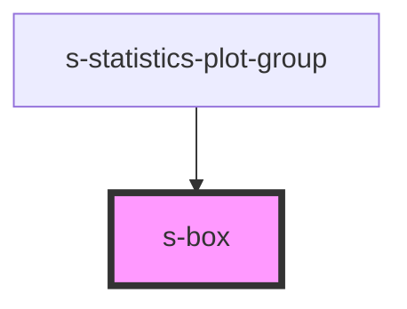

# s-box

<!-- Auto Generated Below -->

## Properties

| Property               | Attribute                | Description | Type                         | Default              |
| ---------------------- | ------------------------ | ----------- | ---------------------------- | -------------------- |
| `boxFill`              | `box-fill`               |             | `string`                     | `'rgb(240,255,255)'` |
| `boxStroke`            | `box-stroke`             |             | `string`                     | `'rgb(0,0,0)'`       |
| `connectionLineStroke` | `connection-line-stroke` |             | `string`                     | `'rgb(0,0,0)'`       |
| `maxLineStroke`        | `max-line-stroke`        |             | `string`                     | `'rgb(0,0,0)'`       |
| `medianLineStroke`     | `median-line-stroke`     |             | `string`                     | `'rgb(0,0,0)'`       |
| `minLineStroke`        | `min-line-stroke`        |             | `string`                     | `'rgb(0,0,0)'`       |
| `orientation`          | `orientation`            |             | `"horizontal" \| "vertical"` | `'horizontal'`       |
| `scaleMaxValue`        | `scale-max-value`        |             | `number`                     | `undefined`          |
| `scaleMinValue`        | `scale-min-value`        |             | `number`                     | `undefined`          |
| `values`               | `values`                 |             | `number[] \| string`         | `undefined`          |

## Dependencies

### Used by

 - [s-statistics-plot-group](../s-statistics-plot-group)

### Graph

----------------------------------------------

*Built with [StencilJS](https://stenciljs.com/)*
