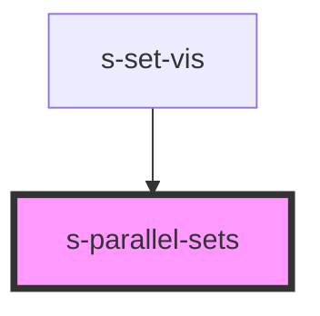

# s-parallel-sets

<!-- Auto Generated Below -->

## Properties

| Property                       | Attribute                          | Description | Type                                | Default                |
| ------------------------------ | ---------------------------------- | ----------- | ----------------------------------- | ---------------------- |
| `axisBoxFill`                  | `axis-box-fill`                    |             | `string`                            | `'rgb(100,100,100)'`   |
| `axisBoxWidth`                 | `axis-box-width`                   |             | `number`                            | `15`                   |
| `axisHeaderTextColor`          | `axis-header-text-color`           |             | `string`                            | `'rgb(0,0,0)'`         |
| `axisHeaderTextSize`           | `axis-header-text-size`            |             | `number`                            | `16`                   |
| `axisHeaderTextWeight`         | `axis-header-text-weight`          |             | `string`                            | `'bold'`               |
| `axisSegmentTextColor`         | `axis-segment-text-color`          |             | `string`                            | `'rgb(0,0,0)'`         |
| `axisStrokeWidth`              | `axis-stroke-width`                |             | `number`                            | `2`                    |
| `colorScheme`                  | --                                 |             | `string[]`                          | `[...d3.schemeAccent]` |
| `data`                         | --                                 |             | `ParallelSetsDataRecord[]`          | `[]`                   |
| `dimensionValuesMap`           | --                                 |             | `Map<string, (string \| number)[]>` | `undefined`            |
| `dimensions`                   | --                                 |             | `string[]`                          | `undefined`            |
| `maxSegmentLimit`              | `max-segment-limit`                |             | `number \| number[]`                | `10`                   |
| `maxSegmentMarginRatioAllowed` | `max-segment-margin-ratio-allowed` |             | `number`                            | `.1`                   |
| `mergedSegmentMaxRatio`        | `merged-segment-max-ratio`         |             | `number`                            | `1`                    |
| `mergedSegmentName`            | `merged-segment-name`              |             | `string`                            | `'*Other*'`            |
| `minimumRatioToShowAxisText`   | `minimum-ratio-to-show-axis-text`  |             | `number`                            | `0`                    |
| `ribbonHighlightOpacity`       | `ribbon-highlight-opacity`         |             | `number`                            | `.8`                   |
| `ribbonOpacity`                | `ribbon-opacity`                   |             | `number`                            | `.5`                   |
| `ribbonTension`                | `ribbon-tension`                   |             | `number`                            | `1`                    |
| `sideMargin`                   | `side-margin`                      |             | `number`                            | `2`                    |
| `textureDefinitions`           | --                                 |             | `string[]`                          | `undefined`            |
| `useTextures`                  | `use-textures`                     |             | `boolean`                           | `false`                |

## Events

| Event                   | Description | Type                                               |
| ----------------------- | ----------- | -------------------------------------------------- |
| `axisHeaderClick`       |             | `CustomEvent<string>`                              |
| `axisHeaderContextMenu` |             | `CustomEvent<string>`                              |
| `axisSegmentClick`      |             | `CustomEvent<ParallelSetsDataNode[]>`              |
| `ribbonClick`           |             | `CustomEvent<ParallelSetsDataNode>`                |
| `visLoaded`             |             | `CustomEvent<Map<string, ParallelSetsDataNode[]>>` |

## Dependencies

### Used by

 - [s-set-vis](../s-set-vis)

### Graph

----------------------------------------------

*Built with [StencilJS](https://stenciljs.com/)*
