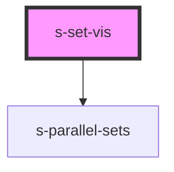

# s-set-vis

<!-- Auto Generated Below -->

## Properties

| Property                    | Attribute                      | Description | Type     | Default |
| --------------------------- | ------------------------------ | ----------- | -------- | ------- |
| `data`                      | --                             |             | `any[]`  | `[]`    |
| `parallelSetsRibbonTension` | `parallel-sets-ribbon-tension` |             | `number` | `1`     |

## Dependencies

### Depends on

- s-parallel-sets

### Graph

----------------------------------------------

*Built with [StencilJS](https://stenciljs.com/)*
