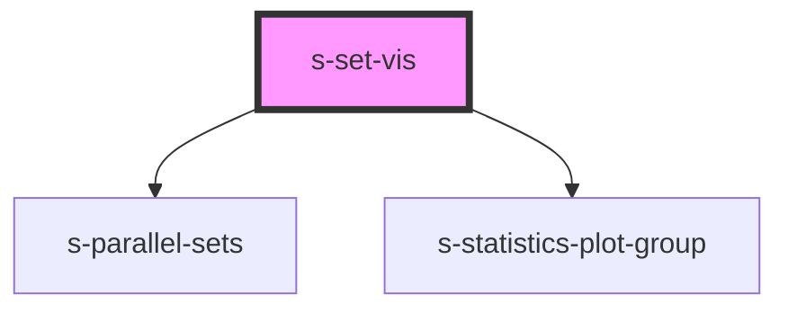

# s-set-vis

<!-- Auto Generated Below -->

## Properties

| Property                    | Attribute                      | Description | Type       | Default     |
| --------------------------- | ------------------------------ | ----------- | ---------- | ----------- |
| `data`                      | --                             |             | `any[]`    | `[]`        |
| `parallelSetsDimensions`    | --                             |             | `string[]` | `undefined` |
| `parallelSetsRibbonTension` | `parallel-sets-ribbon-tension` |             | `number`   | `1`         |
| `statisticsPlotGroups`      | --                             |             | `string[]` | `undefined` |

## Dependencies

### Depends on

- s-parallel-sets
- [s-statistics-plot-group](../s-statistics-plot-group)

### Graph

----------------------------------------------

*Built with [StencilJS](https://stenciljs.com/)*
