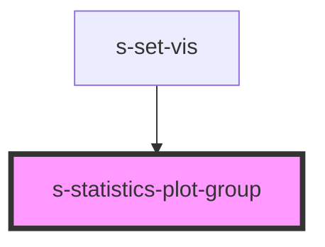

# s-statistics-plot-group

<!-- Auto Generated Below -->

## Properties

| Property | Attribute | Description | Type     | Default     |
| -------- | --------- | ----------- | -------- | ----------- |
| `header` | `header`  |             | `string` | `undefined` |

## Dependencies

### Used by

 - [s-set-vis](../s-set-vis)

### Graph

----------------------------------------------

*Built with [StencilJS](https://stenciljs.com/)*
