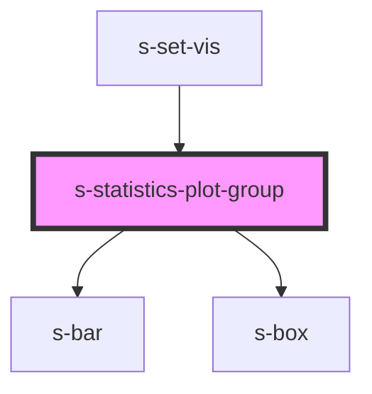

# s-statistics-plot-group

<!-- Auto Generated Below -->

## Properties

| Property                           | Attribute          | Description | Type                                  | Default     |
| ---------------------------------- | ------------------ | ----------- | ------------------------------------- | ----------- |
| `data`                             | --                 |             | `any[]`                               | `undefined` |
| `dimensionName`                    | `dimension-name`   |             | `string`                              | `undefined` |
| `headerTextSize`                   | `header-text-size` |             | `number`                              | `16`        |
| `isSelected`                       | `is-selected`      |             | `boolean`                             | `false`     |
| `parallelSetsColorScheme`          | --                 |             | `string[]`                            | `undefined` |
| `parallelSetsDimensionNodeListMap` | --                 |             | `Map<string, ParallelSetsDataNode[]>` | `undefined` |
| `visType`                          | `vis-type`         |             | `string`                              | `undefined` |

## Events

| Event         | Description | Type                            |
| ------------- | ----------- | ------------------------------- |
| `headerClick` |             | `CustomEvent<string>`           |
| `rowClick`    |             | `CustomEvent<number \| string>` |

## Dependencies

### Used by

 - [s-set-vis](../s-set-vis)

### Depends on

- [s-bar](../s-bar)
- [s-box](../s-box)

### Graph

----------------------------------------------

*Built with [StencilJS](https://stenciljs.com/)*
